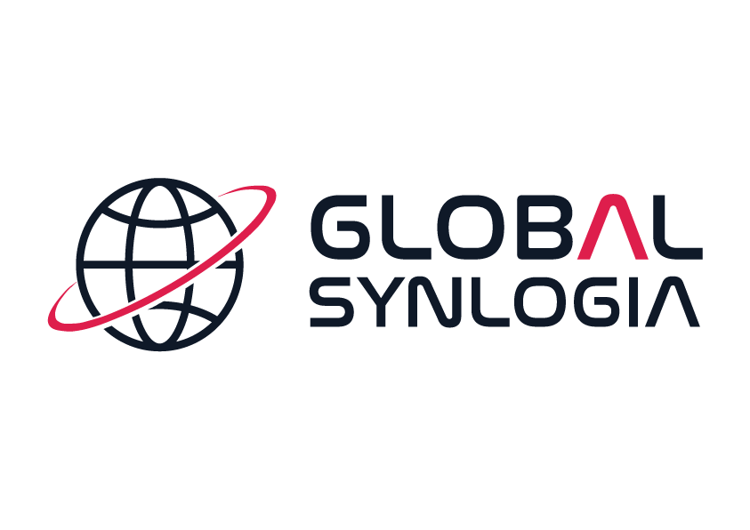

# Global Synlogia Laravel

<p align="center">
  
</p>

<p align="center">
  <strong>Kompleksowe rozwiązania IT dla Twojego biznesu</strong>
</p>

## O Projekcie

Global Synlogia Laravel to nowoczesna aplikacja webowa zbudowana w oparciu o framework Laravel z wykorzystaniem Tailwind CSS. Projekt oferuje modularną architekturę komponentów oraz responsywny design zapewniający doskonałe doświadczenie użytkownika.

### Główne Funkcjonalności

- **Modularny system komponentów** - wykorzystanie Laravel Blade z dyrektywami @push/@stack
- **Responsywny design** - pełna kompatybilność z urządzeniami mobilnymi
- **Animacje CSS** - płynne przejścia i efekty wizualne
- **Offline-first** - wszystkie zasoby przechowywane lokalnie
- **Sticky Header** - niebieski pasek informacyjny i nawigacja pozostają na górze strony
- **Badge Slider** - animowany slider z technologiami (22 technologie)
- **Sekcja usług** - prezentacja 6 głównych usług firmy z animacjami
- **Tech Section** - 4 karty technologiczne (Python, React, Node.js, FastAPI)
- **Services Slider** - auto-rotujący carousel z 5 usługami
- **Contact Section** - funkcjonalny formularz kontaktowy z mapą informacji
- **Footer** - kompletna stopka z informacjami o firmie i social links

### Technologie

- **Backend**: Laravel 11.x
- **Frontend**: Tailwind CSS 3.4.1
- **Build Tool**: Vite
- **Fonty**: Instrument Sans (lokalne)
- **JavaScript**: Vanilla JS z modularną architekturą

## Instalacja i Uruchomienie

### Wymagania

- PHP >= 8.2
- Composer
- Node.js >= 18.x
- npm lub yarn

### Kroki instalacji

1. **Sklonuj repozytorium**
   ```bash
   git clone git@github.com-global:gsynlogia/global_synlogia_laravel.git
   cd global_synlogia_laravel
   ```

2. **Zainstaluj zależności PHP**
   ```bash
   composer install
   ```

3. **Zainstaluj zależności JavaScript**
   ```bash
   npm install
   ```

4. **Utwórz plik środowiskowy**
   ```bash
   cp .env.example .env
   ```

5. **Wygeneruj klucz aplikacji**
   ```bash
   php artisan key:generate
   ```

### Uruchomienie projektu

1. **Uruchom serwer Laravel**
   ```bash
   php artisan serve --port=8002
   ```

2. **Uruchom Vite (w osobnym terminalu)**
   ```bash
   npm run dev
   ```

3. **Otwórz przeglądarkę**
   ```
   http://localhost:8002
   ```

### Uruchomienie w trybie produkcyjnym

1. **Zbuduj zasoby dla produkcji**
   ```bash
   npm run build
   ```

2. **Uruchom serwer**
   ```bash
   php artisan serve --port=8002
   ```

## Struktura Projektu

```
├── resources/views/
│   ├── components/          # Komponenty Blade
│   │   ├── header.blade.php         # Kombinowany header (info-banner + navigation)
│   │   ├── badge-slider.blade.php   # Slider z technologiami
│   │   ├── services-section.blade.php # Główne usługi
│   │   ├── tech-section.blade.php   # Karty technologiczne
│   │   ├── services-slider.blade.php # Carousel usług
│   │   ├── contact-section.blade.php # Sekcja kontaktowa
│   │   └── footer.blade.php         # Stopka strony
│   └── home.blade.php       # Główny widok
├── public/
│   ├── css/                 # Style CSS
│   ├── js/                  # Pliki JavaScript
│   ├── fonts/               # Fonty lokalne
│   └── logo-color.png       # Logo firmy
├── resources/css/           # Źródła CSS
└── resources/js/            # Źródła JavaScript
```

## Architektura Komponentów

Projekt wykorzystuje modularną architekturę z wykorzystaniem Laravel Blade:

- **@push/@stack** - zarządzanie stylami i skryptami komponentów
- **@include** - włączanie komponentów do głównego widoku
- **Namespace naming** - unikalne klucze dla każdego komponentu

### Przykład komponentu

```blade
{{-- Komponent --}}
<div class="component">
    <!-- Zawartość komponentu -->
</div>

@push('style_component_name')
<style>
    /* Style komponentu */
</style>
@endpush

@push('script_component_name')
<script>
    // JavaScript komponentu
</script>
@endpush
```

## Dostępne Komponenty

### Header Component
- **Lokalizacja**: `resources/views/components/header.blade.php`
- **Funkcjonalność**: Kombinowany header z info banner i nawigacją
- **Features**: Sticky positioning, mobile menu, smooth scroll

### Badge Slider
- **Lokalizacja**: `resources/views/components/badge-slider.blade.php`
- **Funkcjonalność**: Animowany slider z 22 technologiami
- **Features**: Infinite scroll, hover effects, responsive design

### Services Section
- **Lokalizacja**: `resources/views/components/services-section.blade.php`
- **Funkcjonalność**: 6 głównych usług firmy
- **Features**: Intersection Observer animations, hover effects

### Tech Section
- **Lokalizacja**: `resources/views/components/tech-section.blade.php`
- **Funkcjonalność**: 4 karty technologiczne
- **Features**: Animated reveal, hover transformations

### Services Slider
- **Lokalizacja**: `resources/views/components/services-slider.blade.php`
- **Funkcjonalność**: Auto-rotujący carousel z usługami
- **Features**: Navigation dots, auto-rotation, interactive cards

### Contact Section
- **Lokalizacja**: `resources/views/components/contact-section.blade.php`
- **Funkcjonalność**: Formularz kontaktowy i informacje
- **Features**: Two-column layout, form validation ready

### Footer
- **Lokalizacja**: `resources/views/components/footer.blade.php`
- **Funkcjonalność**: Kompletna stopka strony
- **Features**: Four-column grid, social links, company info

## Dostępne Komendy

- `php artisan serve` - uruchomienie serwera deweloperskiego
- `npm run dev` - uruchomienie Vite w trybie deweloperskim
- `npm run build` - budowanie zasobów dla produkcji
- `composer install` - instalacja zależności PHP
- `npm install` - instalacja zależności JavaScript

## Status Projektu

✅ **Kompletna implementacja** - Wszystkie sekcje strony zaimplementowane
✅ **Modularny design** - Każda sekcja w osobnym komponencie
✅ **Responsive design** - Pełna kompatybilność mobilna
✅ **Sticky header** - Header zachowuje się identycznie jak na froncie Next.js
✅ **Animacje** - Intersection Observer i CSS animations
✅ **Offline-first** - Wszystkie zasoby lokalne

## Przyda się też

### Cachowanie Laravel (Optymalizacja wydajności)

**Włączenie cache (production):**
```bash
php artisan view:cache        # Cache widoków Blade
php artisan config:cache      # Cache konfiguracji
php artisan route:cache       # Cache routingu
php artisan optimize          # Wszystkie cache naraz
php artisan event:cache       # Cache eventów
```

**Czyszczenie cache (development):**
```bash
php artisan view:clear        # Czyść gdy zmieniasz widoki
php artisan config:clear      # Czyść gdy zmieniasz config
php artisan route:clear       # Czyść gdy dodajesz nowe routes
php artisan optimize:clear    # Czyść wszystkie cache
```

**Dodatkowe optymalizacje:**
```bash
composer install --optimize-autoloader --no-dev  # Optymalizacja autoloadera
npm run build                                     # Minifikacja JS/CSS
```

## Wsparcie

W przypadku problemów lub pytań, skontaktuj się z zespołem Global Synlogia.

---

<p align="center">
  Zbudowane z ❤️ przez <strong>Global Synlogia</strong>
</p>
